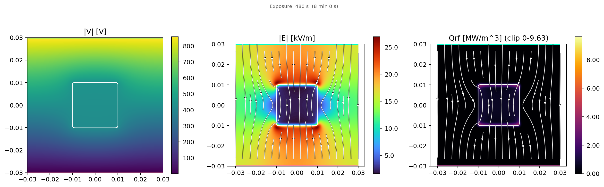
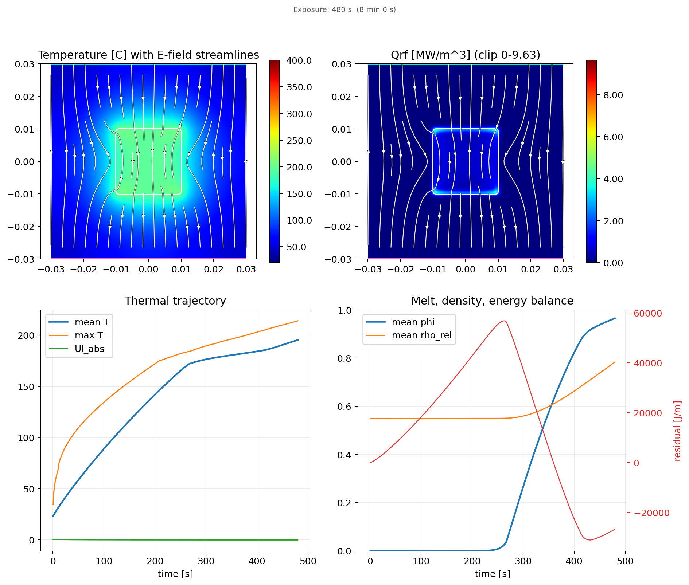
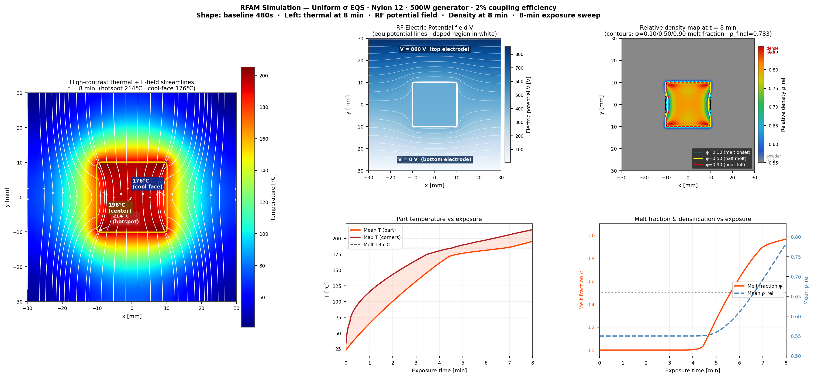
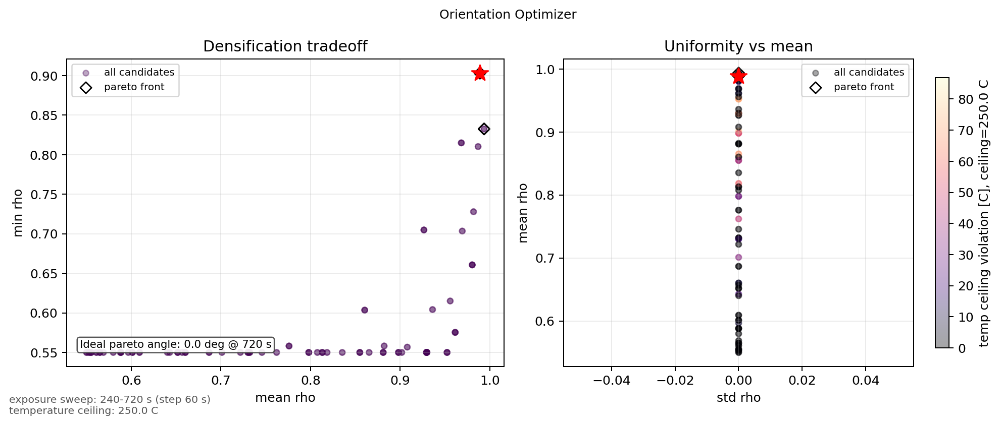
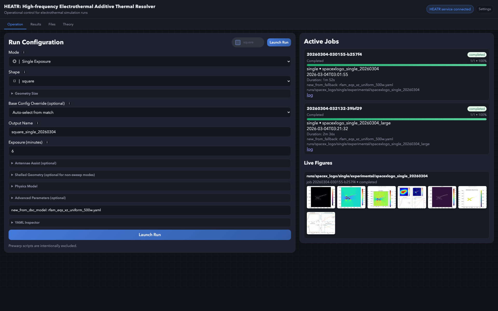
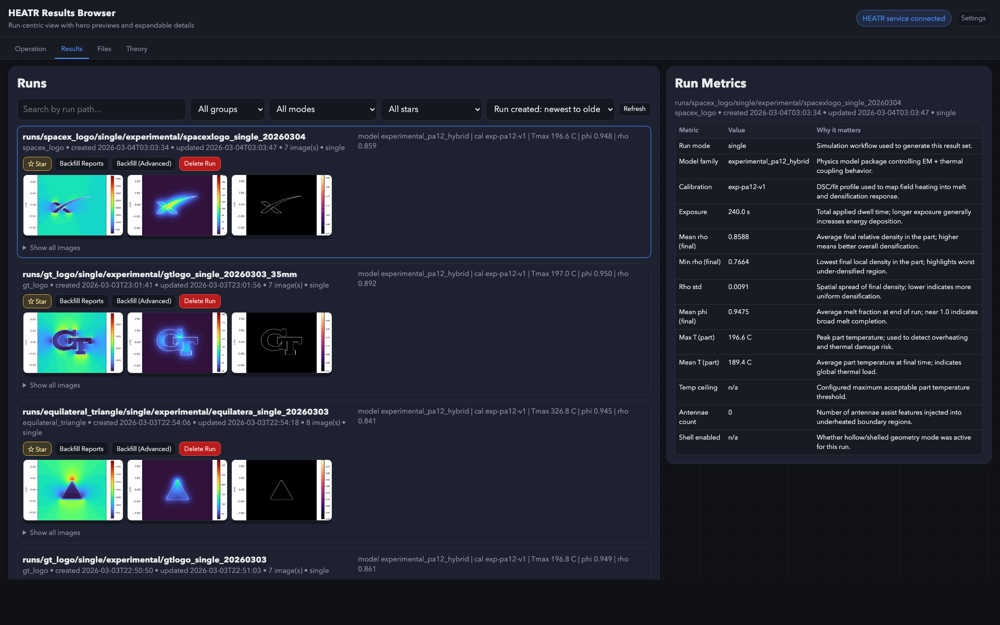
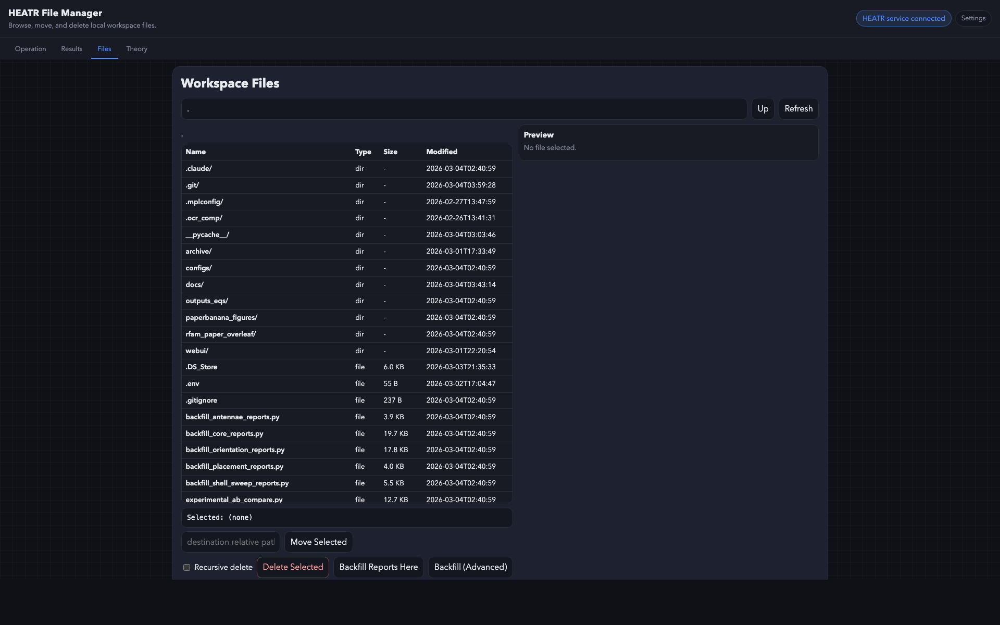
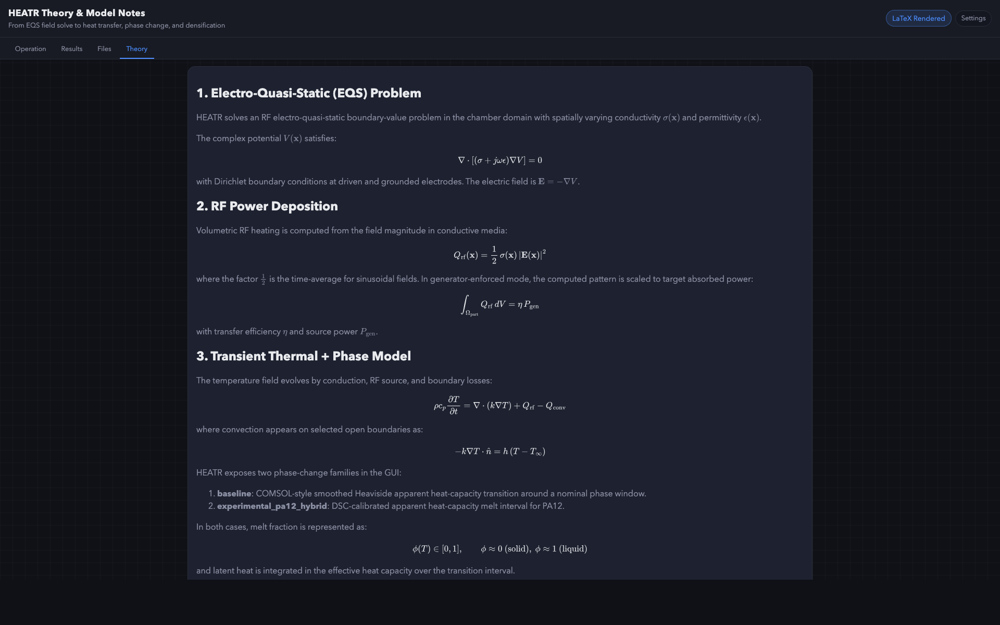

# HEATR: High-frequency Electrothermal Additive Thermal Resolver

HEATR is a 2D electrothermal RF simulation platform for polymer additive manufacturing workflows.
It couples:
- electro-quasi-static (EQS) field solve,
- RF volumetric heating,
- transient thermal transport,
- melt progression and densification metrics,
- optional process-assist geometry features (antennae, shells),
- optimization workflows (exposure, orientation, placement).

The project includes both:
- a Python solver/runtime (`rfam_eqs_coupled.py`), and
- a browser GUI (`rfam_gui_server.py` + `webui/static/*`).

---

## What Is Current (Mar 2026)

### Core run modes
- `single` (single exposure)
- `sweep` (exposure sweep)
- `optimizer` (exposure optimizer)
- `turntable` (scheduled rotation events)
- `orientation_optimizer` (angle + exposure Pareto workflow)
- `placement_optimizer` (multi-part layout optimization)
- `shell_sweep` (shell thickness sweep)

### GUI / workflow upgrades
- Operation / Results / Files / Theory pages
- Job queue with progress, reorder, pause/resume/cancel, duration tracking
- Results page filters (mode/group/star), run starring, delete run action
- Metrics side panel with contextual descriptions
- File manager with in-browser preview, move/delete, and backfill actions
- Geometry size override (`Desired size (mm)`) with nominal size + aspect lock

### Reporting & backfill
- Unified queue-backed backfill endpoint for run artifacts:
  - `POST /api/tools/backfill-reports`
- Per-run manifest support:
  - `report_manifest.json`
- Module registry covers core reports + mode-specific diagnostics (orientation, placement, shell sweep, antennae)
- Versioned non-destructive backfill outputs:
  - `*.backfill.<module_id>.<timestamp>.*`

---

## Physics Model (Including DSC-Calibrated Phase Change)

HEATR supports a baseline model and an experimental PA12 hybrid model family.

The experimental path uses DSC-calibrated melt transition values from:
- `configs/experimental_pa12_dsc_profile.yaml`
- `configs/experimental_pa12_provenance.yaml`

Current PA12 DSC profile (`pa12-dsc-v1`):
- melt onset: **171.0 C**
- melt peak: **180.8 C**
- melt end: **186.0 C**
- latent heat: **101700 J/kg**

These are used by the experimental phase model flow when enabled (for example apparent-heat-capacity style phase behavior in the experimental stack).

---

## Antennae / Spike Migration

Canonical naming is now **antennae**. Legacy `spike` keys are still accepted as compatibility aliases.

Implemented controls include:
- hard on/off gate,
- global or auto size mode,
- EQS/Qrf-based preview and calibration flow,
- backfill module support for antennae diagnostics.

### Antennae concept (why this exists)

The antennae/spike feature is a field-shaping assist for geometries that have persistently undercoupled regions.

Core idea:
- add small protrusions at selected boundary locations to create local field concentration points,
- those concentration points pull or redirect nearby E-field lines toward low-coupling zones,
- this raises local RF power deposition (`Qrf`) where heating is normally weak,
- which helps reduce underheating and improve final densification uniformity.

In short, antennae are intentional geometric perturbations used to redistribute electromagnetic coupling toward parts of the shape that would otherwise lag thermally.

---

## Output Organization

Run outputs are organized under:

`outputs_eqs/runs/<shape>/<mode>/<model-family>/<run_name>/`

Examples:
- `outputs_eqs/runs/square/single/experimental/...`
- `outputs_eqs/runs/T_shape/orientation_optimizer/experimental/...`
- `outputs_eqs/runs/square/shell_sweep/experimental/...`

> Generated outputs are intentionally excluded from Git tracking.

---

## Quick Start

### 1) Launch GUI
```bash
python3 rfam_gui_server.py
```
Open [http://127.0.0.1:8080](http://127.0.0.1:8080)

### 2) Run headless single case (example)
```bash
python3 rfam_eqs_coupled.py \
  --config configs/rfam_eqs_xz_uniform_500w.yaml \
  --output-dir outputs_eqs/runs/square/single/baseline/manual_example
```

### 3) Generate orientation diagnostics from existing run artifacts
Use Results/File Manager backfill buttons, or call API:
```bash
curl -X POST http://127.0.0.1:8080/api/tools/backfill-reports \
  -H 'Content-Type: application/json' \
  -d '{"output_dir":"outputs_eqs/runs/T_shape/orientation_optimizer/experimental/tshape_orient_20260303"}'
```

---

## Example Figures

### Square baseline (480 s): electric fields


### Square baseline (480 s): paper-style report


### Square baseline (480 s): RF summary v5


### Orientation optimizer report (square)


## GUI Pages (Browser)

### Operation page
Configure and launch runs. This page exposes run mode selection, shape and geometry sizing, physics model controls (including experimental DSC-calibrated options), optional antennae/shell/turntable controls, and live active-job previews.



### Results page
Run-centric review and triage page. Filter/search runs, star important runs, queue report backfills, delete runs, and inspect right-column physics metrics with contextual interpretation.



### Files page
Workspace file manager with in-browser preview. Browse/move/delete files and trigger backfill actions directly from run folders.



### Theory page
Centralized model/theory reference page for equations, assumptions, and interpretation context used by the solver and reports.



---

## Key Files

- Solver core: `rfam_eqs_coupled.py`
- GUI server: `rfam_gui_server.py`
- GUI client logic: `webui/static/app.js`
- Results UI: `webui/static/results.js`
- Files UI: `webui/static/file_manager.js`
- Shape library: `shapes.py`
- Backfill modules:
  - `backfill_core_reports.py`
  - `backfill_orientation_reports.py`
  - `backfill_placement_reports.py`
  - `backfill_shell_sweep_reports.py`
  - `backfill_antennae_reports.py`

---

## Notes

- This repository is now rooted at `geo-prewarp` for direct Git workflows.
- If you use GitHub over SSH, set remote as:
  - `git@github.com:mattlmccoy/heatr.git`
